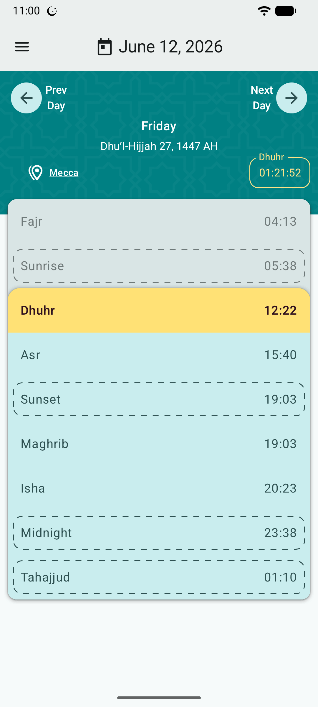
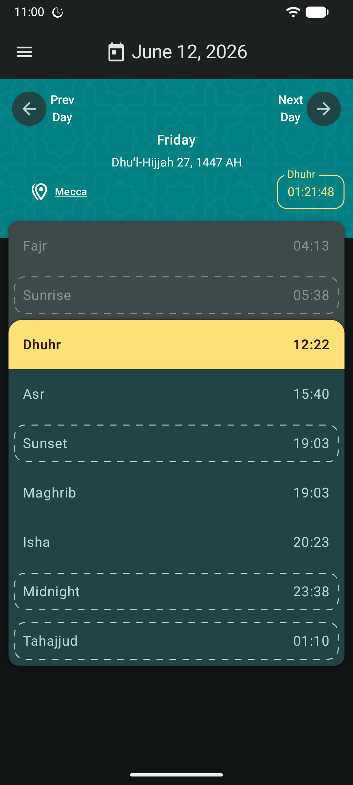
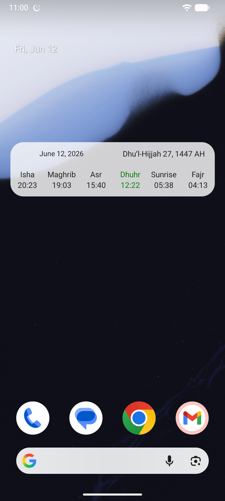
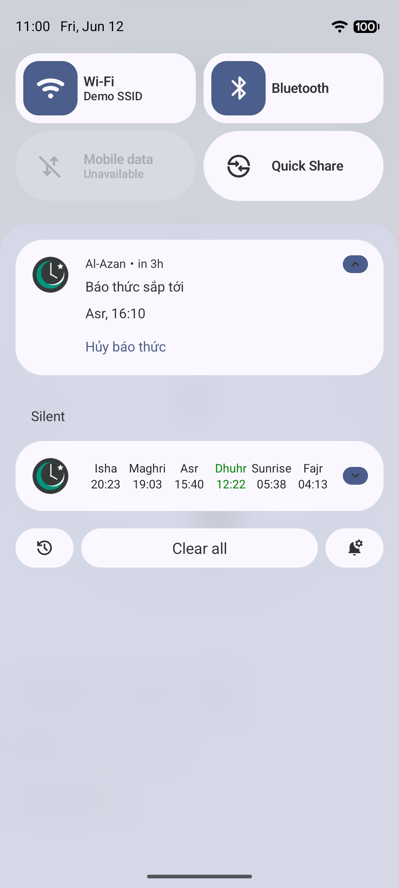

# Al-Azan

an open-source Adhan (أذان) - prayer times application, built natively for Android with Jetpack Compose.

[](https://f-droid.org/packages/com.github.meypod.al_azan/)
[](https://play.google.com/store/apps/details?id=com.github.meypod.al_azan)
[](https://github.com/meypod/al-azan-compose/releases/latest)

## Features

* Ad-Free

* No internet permission — the app can never access the internet

* Doesn't use any kind of trackers

* Open-source

* You can search for your location offline Or use GPS

* Set custom Adhan audio, or pick any sound from your device

* Select different Adhan audio for Fajr namaz

* In addition to five daily prayers, it has settings for Sunrise, Sunset, Midnight and Night Prayer (Tahajjud)

* Many options for Adhan (اذان) calculation

* Light and Dark theme, with Material You dynamic colors

* Hijri calendar with multiple variants, plus other calendars and numbering systems

* Monthly prayer times view

* Hide times you don't need

* Set reminders before or after a prayer time

* Automatically silence your phone after Adhan for a duration you choose (Do Not Disturb)

* View upcoming alarms, and skip the ones you don't want

* Homescreen and notification Widgets

* Qibla finder (map and compass)

* Qada counter

* Backup and restore your settings

* Is localized in English, Persian, Arabic, Turkish, Indonesian, French, Urdu, Hindi, German, Bosnian, Vietnamese, Bangla, Kiswahili

## Screenshots

<table style="width:100%">
  <tr>
    <td></td>
    <td></td>
    <td></td>
    <td></td>
  </tr>
</table>

## How to build this project

Requirements:

* JDK 17+
* Android SDK (or just Android Studio)

1. Clone the project:

```bash
git clone git@github.com:meypod/al-azan.git
```

1. Build:

```bash
# debug build
./gradlew :app:assembleDebug

# release build
./gradlew :app:assembleRelease
```

Or open the project in Android Studio and run it from there.

To uninstall the app while keeping its data:

```bash
adb shell cmd package uninstall -k com.github.meypod.al_azan
```

## Translations

App strings live in Android resource files (`app/src/main/res/values-<locale>/strings.xml`), with English (`values/`) as the source of truth.

### Contributing your language

Pull requests for fixing or adding translations are welcome. Copy `app/src/main/res/values/strings.xml` into a `values-<locale>` folder, translate the strings, and open a PR. Please open an issue first if your language requires a new locale to be registered.

## Thanks to

All of people who have helped this project grow.

## Donate

Donations are appreciated. But I can only accept in crypto, here are my wallet addresses:

Bitcoin:
bc1q2y6fng33tzhc8qefsy2pht057q2rmfx09qyx6v

Ethereum:
0x1a1407f549cb52658a3ed6Eac9C5e850dED4DB2b

Solana:
CBK8ySxbVWrCkb1CQYoR1jYa4hEiMgpnVfJjGLCfBSJ1

Litecoin:
Lbgz2X6TG9ANLGamNpdmhyoMc4q4wBHaVQ

Tron:
THjtLAdihH57mbeaVmBfx3wAAXkpxAnqmJ

Bitcoin cash:
qqgjknfejs4zf4udsalsej2qkwt5es5ym5fwusgvx3
